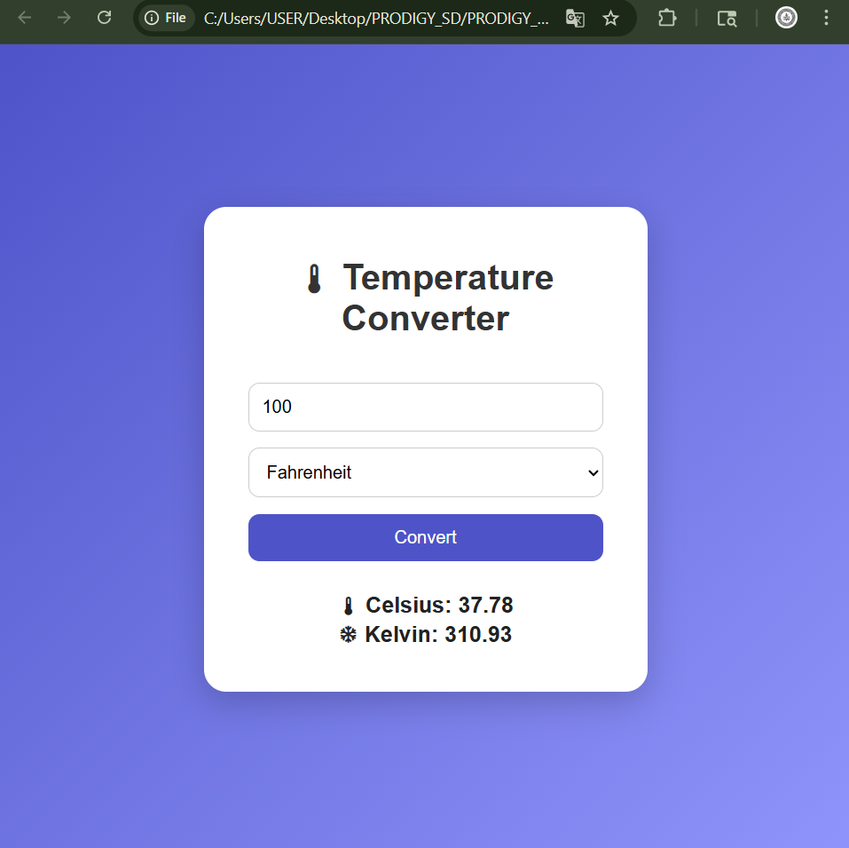

# 🌡️ Temperature Converter

A beautiful full-stack temperature converter web application built using:

- HTML
- CSS
- JavaScript
- Node.js
- Express.js

---

# 🚀 Features

- Convert Celsius, Fahrenheit, Kelvin
- Modern responsive UI
- Frontend + Backend architecture
- Real-time conversion

---

# 📂 Project Structure

```bash
frontend/
backend/
```

---

# ▶️ Run Project

## Install dependencies

```bash
npm install
```

## Start backend

```bash
node backend/server.js
```

## Open frontend

Open:

```bash
frontend/index.html
```

---

# 📸 Screenshot



---

# 📌 Internship Task

Completed as part of the Prodigy InfoTech Software Development Internship.